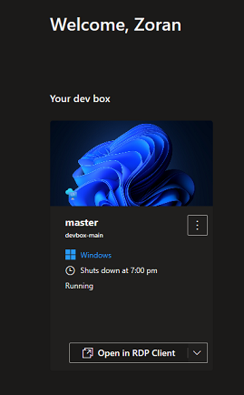
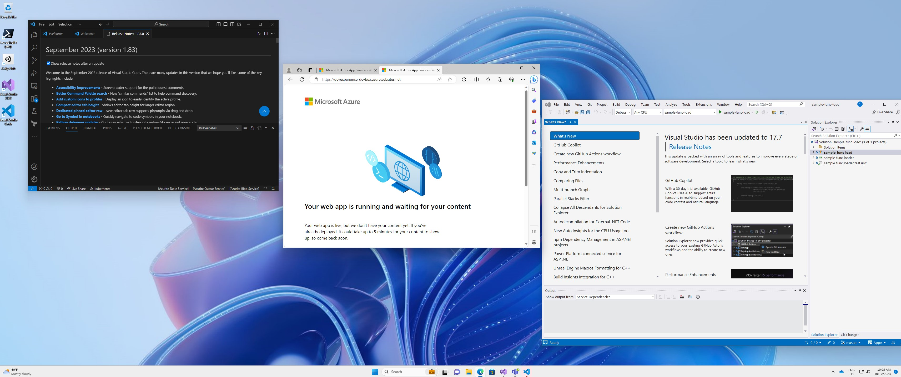
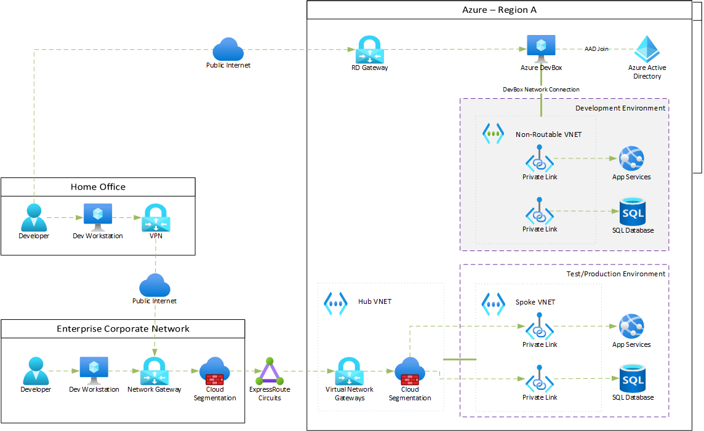

# Azure Developer Experience - Azure DevBox

Azure Developer experience - using Azure DevBox as a primary environment for Azure development.
This document is part of broader [Azure developer experience - Developer environment options analysis document](https://github.com/microsoft/Azure-Dev-Experience-developer-environment-options)

> [!NOTE]
> This is not official Microsoft product documentation. It is maintained by community contributors.
> Please get yourself familiar with Azure DevBox https://learn.microsoft.com/en-us/azure/dev-box/overview-what-is-microsoft-dev-box prior to reading this document.

## Problem Definition

Business solution development team at an enterprise organization requiring strong security controls is facing number of challenges when developing Azure based solutions.
The following use cases are representing some of the key challenges.

Please see [Azure Developer Experience - Development Environment Options - Connecting to Azure private IPs from local developer Workstation](https://github.com/zojovano-articles/azure-developer-environment-options/tree/main#1-connecting-to-azure-private-ips-from-local-developer-workstation) for more details.

## Current Architecture and Developer Experience

Developer is either connecting from office location with corporate network connected to Azure via ExpressRoute (Private Peering) or uses VPN from home office location. VPN is connected to the corporate network and from that point, the flow is the same as connecting from office location.
In both cases, the TLS  connection to Azure services is terminated on the Firewalls and Firewall provided digital certificate is provided for establishing TLS connection.
As described in referenced problem definition, developers have to submit firewall requests for connecting to their development environments hosted in Azure. Developers also have to configure trust for Firewall's digital certificates.
Developers are spending significant time maintaining these connections.

## Developer Experience - Azure DevBox Solution Option

Use of Azure DevBox together with specific environment management practices may address these connectivity challenges.

### Assumptions

The main ***assumption*** is that by having isolated Development environment in "non-routable" Azure VNET, use of Firewalls will not be required.
Rationale for the assumption:
- "Development" environment is not integrated / connected to any other network (it is Sandboxed)
- AzureDevBox uses secure Remote Desktop Gateway managed by Microsoft as an entry point to the developer's VDI
- Azure DevBox host is not connected to corporate network (***if*** AAD Join is used)

Other assumptions:
- There is no need to access corporate network from the Azure DevBox environment. Developer will be using DevBox for development and access to Azure development environment and continue using his Workstation/Laptop to access other corporate services (Office, etc)
- Access to other Azure non-production (System Test, User Acceptance Test, etc) and Production environments is not needed from Azure DevBox. Development teams should deploy and test these environments by using Deployment Automation practices within the overall DevOps practices&processes.

> [!NOTE]
> The use of Azure DevBox which requires use of Firewall in between DevBox and Azure development environment would not address specific problem. 
> It may provide other benefits unrelated to this particular problem (e.g. internet speed, higher compute power, pre-configured dev environments for new developers)

### Solution Description

Developer will use Azure DevBox assigned personal Virtual Desktop. All development tools (e.g. Visual Studio, VSCode, etc) are pre-installed in the virtual desktop.
The desktop is connected to dedicated (sandboxed) development environment in Azure. Azure DevBox is attached to development Azure VNET. The VNET is non-routeable - it is not connected to any other Azure VNET or to corporate network(s).

Azure resources required for development are deployed to the environment and used by the development team as a shared development environment. All Azure resources deployed with private IPs are accessible from developer's DevBox virtual desktop.

There are no Firewalls in between developer's DevBox virtual desktop and Azure resources with private IPs.

The following diagram describes Remote Desktop Gateway architecture. Please ignore Azure Directory Service given that the proposal assumes use of AAD Join instead.

## Code Sample

Infra folder contains Bicep based IaC definition for deploying the sample environment described in this document. Please make sure you insert your environment specific parameters.

# References

- https://learn.microsoft.com/en-us/azure/dev-box/overview-what-is-microsoft-dev-box
- [Understanding Azure Virtual Desktop network connectivity](https://learn.microsoft.com/azure/virtual-desktop/network-connectivity)
